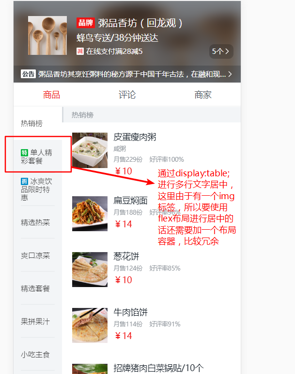
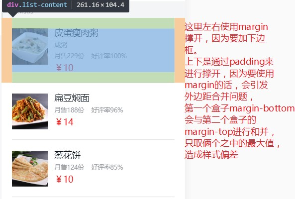

# my-element

> Vue 仿饿了么项目

## rem理解
> rem:假如`<html>`标签上设置了样式`font-size: 16px`，那么`1rem=16px`

代码演示  
```js
(function (doc, win) {
  const html = document.documentElement
  const setRem = () => {
    clearTimeout(timerId)
    const timerId = setTimeout(() => {
      const {width} = html.getBoundingClientRect()
      if (!width) { return }
      html.style.fontSize = width / 7.5 + 'px'
    }, 100)
  }
  win.addEventListener('resize', setRem)
  doc.addEventListener('DOMContentLoaded', setRem)
}(document, window))
```
思路：  
在DOM加载完毕或者屏幕大小发生变化的时候动态设置`html`根元素的字体大小

代码实现：
* 监听`DOMContentLoaded`事件，在初始的`HTML`文档被完全加载和解析完成后（无需等待
样式表、图像和子框架的完成加载），设置`html`的`font-size`
* 监听`resize`事件，在文档视图调整大小（页面大小发生变化时），设置`html`的`font-size`
* 页面中计算`rem`的公式: (设计图元素宽度/10)rem

注意点：
1. 获取宽度要使用`offsetWidth`或者`getBoundingClientRect.width`,
因为`padding+border`会计算到宽度之内的。否则的话获取到的宽度会少`border`值
2. `DOMContentLoaded`事件要绑定到`document`上，而`load`事件要绑定到`window`上
3. `load`:用于一个完全加载的页面，要比`DOMContentLoaded`慢，这里使用后者就可以
4. `html.style.fontSize = width / 75 + px`:这样写之后，设计图宽度/100就可以计算出rem，
但是此时当`chrome`调整到`iphone6/7/8`的时候，`html`的`font-size`是`5px`，即`1rem = 5px`,
可以实际确是:`1rem = 12px`。因为`chrome`浏览器最小字体只支持`12px`,所以将75改为7.5,设计图/10计算
出对应的`rem`。
5. 设置完`rem`之后，还要在`body`中初始化页面的字体大小，否则页面中的字体都会是50px即1rem的大小  
   具体做法：在`reset.less`中，设置：`body{ font-size: 14px; }`

加注释的代码：
```js
/**
 * 监听window的resize事件，动态设置根元素(html)的字体大小
 * 
 */
(function (doc, win) {
  const html = doc.documentElement,
    setHTMLSize = function () {
      // 这里使用offsetWidth比较好，因为clientWidth在加入border的时候，并不会算入在内
      // width = 元素本身宽度 + border + padding
      // var clientWidth = html.clientWidth;
      var offsetWidth = html.offsetWidth;
      if (!offsetWidth) return;
      // 这里相当于offsetWidth / 10
      // 1rem = 屏幕宽度/10
      // html.style.fontSize = 32 * (offsetWidth / 320) + 'px';
      // 这种忽略了一个问题：chrome浏览器支持最小字体为12px;所以 1rem 永远等于12px，并不是 5px
      // html.style.fontSize = (offsetWidth / 75) + 'px';

      // 这样写 1rem = 50px;
      // 此时，设计图的大小/100 rem 即为我们应该写的元素大小
      html.style.fontSize = (offsetWidth / 7.5) + 'px';
    };
  let resizeEvent;
  resizeEvent = 'orientationchange' in window ? 'orientationchange' : 'resize';
  if (!html.addEventListener) return;
  win.addEventListener(resizeEvent, setHTMLSize, false);
  doc.addEventListener('DOMContentLoaded', setHTMLSize, false);
})(document, window);

// DOMContentLoaded: 当初始的HTML文档被完全加载和解析完成之后，DOMContentLoaded事件被触发，而无需等待样式表、子框架的完成加载。

// load: 仅用于一个完全加载的页面

// DOMContentLoaded事件要绑定到`document`对象上，而load事件要绑定到window上
```
## 移动端`1px`实现


## 布局技巧

### 1. 侧边栏多行居中
要实现的效果图:


页面`html`结构：
```html
<ul>
  <li>
    <p>
      
      <span></span> 
    </p>
  </li>
...
</ul>
```
通过`display:table`来进行居中：
```css
li {
  display: table;
  /*设置为display:table之后，宽度会由内容撑开，这里要进行指定*/
  width: 100px;
}
p {
  /*相当于表格中的td标签*/
  display: table-cell;
  /*居中*/
  vertical-align: middle;
  /*文本间距，美化样式*/
  line-height: 14px;
}
```

整体思路： 
* 父元素设置`display: table`
* 子元素设置`display: table-cell;vertical-middle;`进行居中

### 2. 外边距合并
效果图展示： 


### 3. 减少使用`overflow:hidden`属性
在项目中应尽可能避免使用`overflow:hidden;`来实现某些布局（清除浮动等），否则
会可能导致某些子元素在关键位置无法显示

如果有某个元素需要在设置`overflow:hidden`的父元素外面显示，可以通过定位来实现。
只要子元素用来确定偏移量的元素不是该父元素即可 
* 父元素非定位元素，子元素设置:`position: fixed/absolute;`
* 父元素为定位元素，子元素设置：`position: fixed`;

总之，`overflow:hidden`只能限制住相对于它自己的元素的显示和隐藏

### 3. `background-color`初始值为`transparent`

## `Vue`知识
### 1. 访问子组件实例或子元素
有时候我们需要在`JavaScript`里直接访问一个子组件。使得能父组件直接修改子组件
实例上的属性和方法。  

在项目中，我把商品页面的左侧边栏和右侧展示详情分为俩个组件，当点击左侧边栏相应的
分类时，要展示右侧对应的内容，即需要执行让右边移动到相应位置的方法。  

实现方法一：  
* 将左侧边栏对应的索引值通知给父组件
* 父组件在收到通知后直接调用子组件中的方法
```js
// aside组件
methods: {
  handleClick (i, e) {
    // 使用了better-scroll时，会在原有浏览器点击事件基础上再派发一个点击事件
    // 这行代码当触发浏览器点击事件时return
    if (!e._constructed) {
      return
    }
    this.updateSelectSide(i)
    this.$emit('scrollToEl', i)
  }
}

// foods组件
// 收到通知后通过$refs获取子组件实例，并调用子组件方法
<goods-aside @scrollToEl="$refs.goodsList.scrollTop($event)"
             :goodsData="goodsData">
</goods-aside>
```

实现方法二：
* 将左侧边栏对应的索引值通知给父组件
* 父组件将索引值传递个右侧`list`组件
* 右侧`list`组件监听(`watch`)索引值的变化，执行对应的方法
```js
// aside组件
methods: {
  handleClick (i, e) {
    // 使用了better-scroll时，会在原有浏览器点击事件基础上再派发一个点击事件
    // 这行代码当触发浏览器点击事件时return
    if (!e._constructed) {
      return
    }
    this.updateSelectSide(i)
    this.$emit('scrollToEl', i)
  }
}

// foods组件
<goods-aside @scrollToEl="position=$event"
             :goodsData="goodsData">
</goods-aside>
<goods-list v-if="goodsData.length"
            :position="position"
            :goodsData="goodsData">
</goods-list>

// list组件
props: {
  position: {
    type: Number,
    required: true
  }
},
watch: {
  position (val) {
    this.scrollTop(val)
  }
}
```

实现方法三：
* 通过`Vuex`或者`eventBus`和依赖注入(`provide,inject`)实现兄弟组件通信

### `v-if`和`v-show`
> **注意，`v-show`不支持`template`,也不支持`v-else`**

`v-show`: 根据条件展示元素选项，`v-show`的元素始终会被渲染并保留在`DOM`中。
`v-show`只是简单的切换元素的`css`属性`display`  

在封装`CartControl`组件的时候，由于要通过`template`(不想多添加`html`标签影响布局)
控制减少商品按钮和展示数字的内容，只能使用`v-if`。
```html
<div class="cart-control">
  <!--这里一定要使用v-if,v-show不支持template元素，也不支持v-else-->
  <template v-if="visible">
    <div class="left-button" @click="reduce">
      <base-icon icon="reduce"></base-icon>
    </div>
    <div class="number">10</div>
  </template>
  <div class="right-button" @click="plus">
    <base-icon icon="plus"></base-icon>
  </div>
</div>
```

### [`Vue`响应式](https://cn.vuejs.org/v2/guide/list.html#%E6%B3%A8%E6%84%8F%E4%BA%8B%E9%A1%B9)
> 响应式：视图层（页面中）

由于`JavaScript`的限制，`Vue`不能检测以下变动的数组：  
1. 当你利用索引直接修改一个项时，例如：`vm.items[indexOfItem] = newValue`
2. 当你修改数组长度时，例如：`vm.items.length = newValue`

还是由于`JavaScript`的限制，`Vue`不能检测**对象属性的添加或删除**：
```js
var vm = new Vue({
  data: {
    a: 1
  }
})
// vm.a是响应式
vm.b = 2;
// vm.b不是响应式
```
可以使用`vm.$set`方法来实现响应式：  
```js
// 数组
// vm.items: 要操作的数组，indexOfItem:要修改数组中对应项的索引，newValue:修改后的值
vm.$set(vm.items,indexOfItem,newValue)

// 对象
vm.$set(object,key,value)
```

项目使用场景： 
* 由孙子组件将值传回，并将对应的索引传回，根据索引来修改原数组
* 由孙子组件将值传回，在原有对象上先添加一个属性，并赋值
```js
updateFood (data, index1, index2) {
  // this.goodsData[index2].foods[index1].count = data.count
  // 对象添加一个新的属性
  this.$set(this.goodsData[index2].foods[index1], 'count', data.count)
  //这里要用三等号，因为item.name === data.name这是条件语句，而不是赋值语句
  const temp = this.selectFood.findIndex(item => item.name === data.name)
  if (temp > -1) {
    // 利用索引直接设置一个项时，vue不能在视图层检测到数组的变动
    // this.selectFood[temp].count = data.count
    // 根据索引值来修改数组
    this.$set(this.selectFood, temp, data)
  } else {
    this.selectFood.push(data)
  }
},
updateSelectFood (data, index) {
  // 根据索引值来修改数组
  this.$set(this.selectFood, index, data)
}
```
